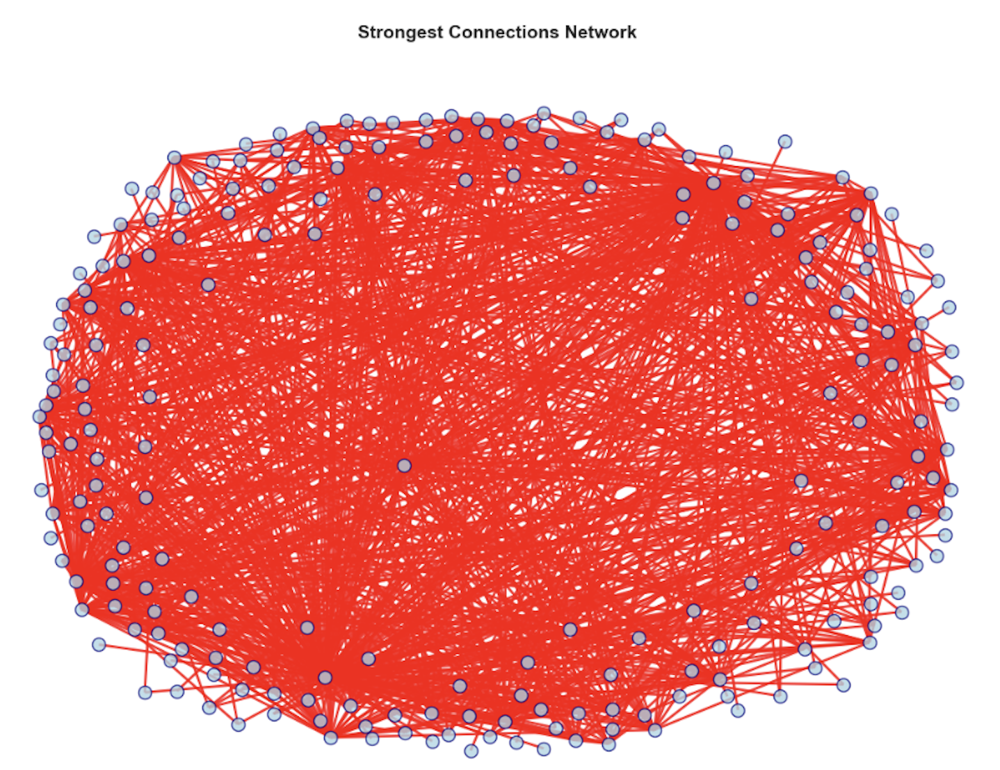
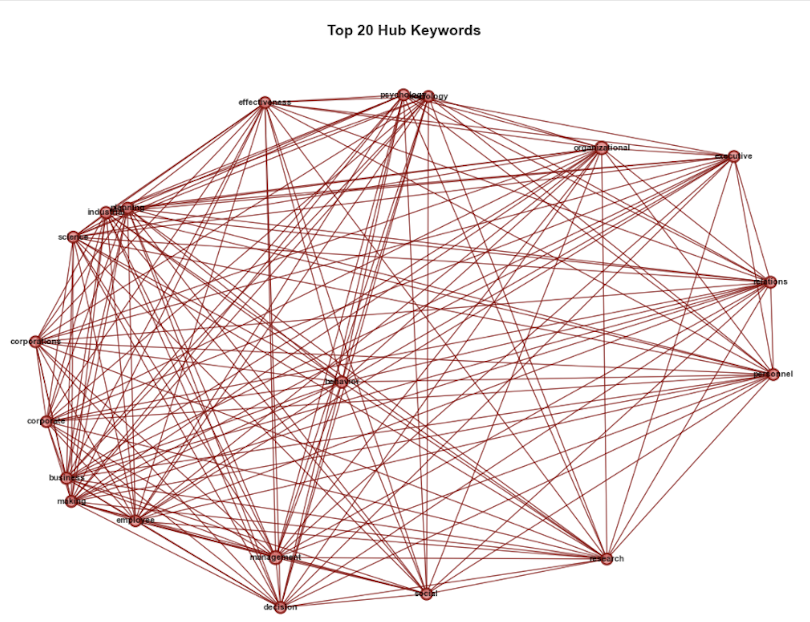

# 🧠 Network & Word Frequency Analysis for Data Mining

**Author:** Rosalina Torres  
**Program:** M.S. Data Analytics Engineering, Northeastern University  
**Focus:** Keyword Co-occurrence | Network Graphs | Frequency Insights  
**Tools:** Python | NLTK | NetworkX | Pandas | Matplotlib

---

## 📌 Overview
This project applies network science and text mining to uncover semantic relationships within a dataset of academic article metadata. By modeling co-occurrence patterns among keywords, I identified emergent themes, semantic bridges, and topic centrality. The result is a network graph where:
- **Nodes** = individual keywords  
- **Edges** = frequency of co-occurrence  
- **Edge Weights** = strength of keyword connection
## Network Visualization

This project includes network analysis of keyword co-occurrences. Here's a visualization of the network:

This project demonstrates how data mining and visualization can enhance content discovery, research mapping, and thematic analysis.

---

## 🎯 Objective
Construct a weighted, undirected graph that reveals latent thematic structures by:
- Representing keywords as nodes
- Connecting co-occurring keywords within the same article
- Quantifying edge strength based on frequency
- Identifying central concepts and thematic clusters within the literature

---

## 🔍 Methodology
1. **Data Collection & Preparation**
   - Gathered metadata from academic articles including titles, abstracts, and keywords
   - Performed data quality assessment and cleaning
   - Standardized formatting and resolved inconsistencies in keyword representation

2. **Text Preprocessing Pipeline**
   - Lowercasing and punctuation removal
   - Tokenization with special handling for multi-word phrases
   - Stopword removal using customized NLTK lists
   - Lemmatization to normalize word forms
   - N-gram identification for compound terms

3. **Keyword Extraction & Analysis**
   - Extracted author-assigned keywords from article metadata
   - Applied frequency analysis to identify prominent terms
   - Generated descriptive statistics (distribution, variance, etc.)
   - Identified core vocabulary across the corpus

4. **Co-occurrence Matrix Construction**
   - Generated all possible keyword pairs within each document
   - Built symmetric co-occurrence matrix tracking frequency
   - Applied normalization techniques to account for varying keyword frequencies
   - Filtered low-frequency co-occurrences to reduce noise

5. **Network Modeling & Analysis**
   - Converted co-occurrence matrix to weighted graph structure
   - Computed graph metrics:
     - Node-level metrics: degree, eigenvector centrality, betweenness
     - Network-level metrics: density, diameter, modularity
   - Applied community detection algorithms (Louvain method)
   - Identified influential nodes and structural patterns

6. **Visualization Development**
   - Created force-directed layouts to represent network structure
   - Implemented size and color encoding to represent metrics
   - Developed interactive components for exploration
   - Generated interpretable visual outputs for analysis

---

## 🧠 Key Concepts

### Network Analysis Fundamentals
- **Graph Theory**: Mathematical structures used to model pairwise relations between entities
- **Centrality Measures**: Methods to identify important nodes in a network
  - *Degree Centrality*: Number of connections a node has
  - *Betweenness Centrality*: Frequency a node acts as a bridge along shortest paths
  - *Eigenvector Centrality*: Influence of a node based on connections to other influential nodes
- **Community Detection**: Identifying clusters of densely connected nodes
- **Small-World Networks**: Networks with high clustering and short average path lengths

### Text Mining Techniques
- **Term Frequency-Inverse Document Frequency (TF-IDF)**: Statistical measure evaluating word importance
- **Collocation Analysis**: Identification of words that commonly appear together
- **Semantic Networks**: Representing meaning relationships between concepts
- **Keyword Extraction**: Methods for identifying significant terms in a corpus
- **Co-word Analysis**: Study of co-occurrence patterns to map knowledge domains

### Data Visualization Principles
- **Visual Encoding**: Mapping data variables to visual properties
- **Network Layouts**: Algorithms for positioning nodes and edges
- **Color Theory**: Strategic use of color to represent data dimensions
- **Cognitive Load Management**: Techniques to present complex information effectively

---

## 🔧 Tools & Technologies (Detailed)

### Programming & Development
- **Python 3.8+**: Core programming language
- **Jupyter Notebook**: Interactive development environment
- **Git**: Version control system

### Data Processing & Analysis
- **Pandas 1.3.4**: Data manipulation and analysis
  - DataFrame operations
  - Data cleaning workflows
  - Statistical functions
- **NumPy 1.21.0**: Numerical computing
  - Matrix operations
  - Mathematical functions
  - Random sampling

### Natural Language Processing
- **NLTK 3.6.5**: Natural language toolkit
  - Tokenization
  - Stopword removal
  - Part-of-speech tagging
- **Scikit-learn 1.0.1**: Machine learning library
  - TF-IDF vectorization
  - Dimensionality reduction
  - Clustering algorithms

### Network Analysis
- **NetworkX 2.6.3**: Graph creation and analysis
  - Graph construction
  - Centrality metrics
  - Community detection
  - Graph algorithms
- **PyVis 0.1.9**: Interactive network visualization

### Visualization
- **Matplotlib 3.4.3**: Static visualization
  - Basic plotting
  - Statistical visualization
  - Custom graph styling
- **Seaborn 0.11.2**: Statistical data visualization
  - Enhanced styling
  - Complex statistical plots
- **Plotly 5.3.1**: Interactive visualization
  - Dynamic graph exploration
  - Web-compatible visualizations

---

## 🛠️ Skills Demonstrated

### Technical Skills
- **Programming & Software Development**
  - Python scripting and modular programming
  - Object-oriented design principles
  - Algorithm implementation and optimization
  - Version control and code documentation

- **Data Engineering**
  - Data cleaning and preprocessing pipelines
  - Structured and unstructured data handling
  - Data transformation and normalization
  - Efficient data storage and retrieval

- **Statistical Analysis**
  - Descriptive statistics and exploratory data analysis
  - Distribution analysis and hypothesis testing
  - Correlation analysis and significance testing
  - Statistical interpretation and reporting

- **Machine Learning & Network Science**
  - Graph algorithm implementation
  - Community detection and pattern recognition
  - Feature engineering for network data
  - Dimensionality reduction techniques

### Analytical Skills
- **Critical Thinking**
  - Problem decomposition and structured analysis
  - Evaluation of multiple analytical approaches
  - Interpretation of complex patterns and relationships
  - Drawing evidence-based conclusions

- **Research Methodology**
  - Literature review and knowledge synthesis
  - Experimental design and evaluation
  - Comparative analysis of techniques
  - Documentation of research findings

- **Data Visualization & Communication**
  - Visual representation of complex relationships
  - Design of informative and accessible graphics
  - Storytelling through data
  - Translation of technical findings for diverse audiences

---

## 🔑 Key Findings
- **Theme Identification**: Discovered distinct thematic clusters representing major research domains
- **Bridge Keywords**: Identified terms that connect disparate research areas, suggesting interdisciplinary concepts
- **Centrality Analysis**: Revealed the most influential keywords based on various network metrics
- **Structural Patterns**: Mapped the hierarchical organization of knowledge within the dataset

---

## 📁 Repository Structure

---

## 📈 Use Cases
### Technical Applications
- **Topic Modeling** – Identify dominant themes in research literature
- **Information Retrieval** – Improve tagging and classification systems
- **Domain Mapping** – Visualize evolving research landscapes
- **Trend Analysis** – Track emerging concepts and declining topics

### Business Applications
- **Content Strategy** – Surface trending academic keywords for targeted content
- **Innovation Mapping** – Spot whitespace and new research frontiers
- **Search Optimization** – Improve content discoverability
- **Competitive Intelligence** – Analyze thematic focus areas across organizations

---

## 🔮 Future Work
- Temporal network analysis to track evolving research trends
- Integration of citation data to enhance relationship mapping
- Interactive visualization dashboard for exploratory analysis
- Cross-domain comparison with additional datasets
- Sentiment analysis to evaluate emotional dimensions of topics

---

## 👩‍💻 About the Author
**Rosalina Torres**  
M.S. in Data Analytics Engineering Candidate  
Northeastern University – College of Engineering  
📬 torres.ros@northeastern.edu 
🔗 [LinkedIn Profile](https://www.linkedin.com/in/yourprofile)

---

## 🤝 Acknowledgments
"A beginner's mind in the world of data engineering, with a purpose to make meaning through structure and insight."
